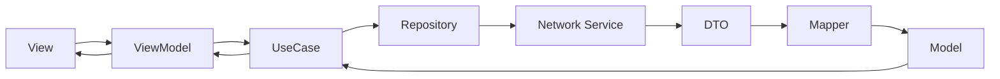

# EventifyAI 🎯

Una aplicación moderna de gestión de eventos desarrollada en SwiftUI siguiendo principios de Clean Architecture y SOLID. La aplicación permite a los usuarios crear, gestionar y participar en eventos de manera intuitiva.

## 📋 Tabla de Contenidos

- [Arquitectura](#-arquitectura)
- [Flujo de Datos](#-flujo-de-datos)
- [DTOs vs Models](#-dtos-vs-models)
- [Manejo de Errores](#-manejo-de-errores)
- [Testing](#-testing)
- [Instalación](#-instalación)
- [Decisiones Técnicas](#-decisiones-técnicas)
- [Estructura del Proyecto](#-estructura-del-proyecto)

## 🏗️ Arquitectura

EventifyAI sigue una arquitectura limpia (Clean Architecture) con separación clara de responsabilidades:

```
┌─────────────────┐
│   Presentation  │ ← SwiftUI Views, ViewModels
├─────────────────┤
│     Domain      │ ← Models, Use Cases, Protocols
├─────────────────┤
│      Data       │ ← Repositories, DTOs, Mappers
├─────────────────┤
│   Infrastructure│ ← Network, Local Storage
└─────────────────┘
```

### Capas de la Aplicación

#### 1. **Presentation Layer**
- **Views**: Interfaz de usuario construida con SwiftUI
- **ViewModels**: Lógica de presentación y estado de la UI
- **Bindings**: Comunicación bidireccional entre Views y ViewModels

#### 2. **Domain Layer**
- **Models**: Entidades de negocio puras (UserModel, EventModel, AttendanceModel)
- **Use Cases**: Lógica de negocio específica (LoginUseCase, EventsUseCase, AttendanceUseCase)
- **Protocols**: Contratos para repositories y servicios

#### 3. **Data Layer**
- **Repositories**: Implementaciones concretas de los protocols del dominio
- **DTOs**: Objetos de transferencia de datos para la red
- **Mappers**: Conversión entre DTOs y Models

#### 4. **Infrastructure Layer**
- **Network**: Servicios de red y APIs
- **Local Storage**: Keychain, UserDefaults, Core Data
- **Utils**: Utilidades y herramientas transversales

## 🔄 Flujo de Datos

El flujo típico de datos en EventifyAI sigue este patrón:



### Ejemplo: Creación de un Evento

1. **View** → Usuario llena formulario y presiona "Crear Evento"
2. **ViewModel** → Valida datos y llama a `CreateEventUseCase`
3. **UseCase** → Aplica reglas de negocio (fecha no en el pasado, título no vacío)
4. **Repository** → Convierte Model a DTO usando `EventMapper`
5. **Network** → Envía `CreateEventDTO` al servidor
6. **Network** → Recibe `EventDTO` del servidor
7. **Repository** → Convierte DTO a Model usando `EventMapper`
8. **UseCase** → Retorna `EventModel` al ViewModel
9. **ViewModel** → Actualiza estado de la UI
10. **View** → Se actualiza automáticamente vía binding

## 📦 DTOs vs Models

### Models (Domain)
- **Propósito**: Representan entidades de negocio puras
- **Ubicación**: `Domain/Entities/`
- **Características**:
  - Contienen lógica de negocio
  - Usan tipos Swift nativos (Date, UUID, etc.)
  - Son inmutables cuando es posible
  - Incluyen validaciones de dominio

```swift
struct EventModel: Identifiable {
    let id: String
    let title: String
    let description: String
    let date: Date // ← Tipo nativo Swift
    let location: String
    
    var isUpcoming: Bool {
        date > Date() // ← Lógica de negocio
    }
}
```

### DTOs (Data Transfer Objects)
- **Propósito**: Transferencia de datos con APIs/red
- **Ubicación**: `Data/DTOs/`
- **Características**:
  - Solo para serialización/deserialización
  - Usan strings para fechas (ISO8601)
  - Sin lógica de negocio
  - Reflejan estructura exacta de la API

```swift
struct EventDTO: Codable {
    let id: String
    let title: String
    let description: String
    let date: String // ← String para API
    let location: String
    let createdAt: String
    let updatedAt: String
}
```

### Mappers
Los mappers se encargan de la conversión bidireccional:

```swift
struct EventMapper {
    static func toModel(from dto: EventDTO) -> EventModel? {
        guard let date = ISO8601DateFormatter().date(from: dto.date) else {
            return nil // Validación de formato
        }
        
        return EventModel(
            id: dto.id,
            title: dto.title,
            date: date // ← Conversión String → Date
            // ...
        )
    }
    
    static func toDTO(from model: EventModel) -> EventDTO {
        return EventDTO(
            id: model.id,
            title: model.title,
            date: ISO8601DateFormatter().string(from: model.date), // ← Date → String
            // ...
        )
    }
}
```

## ⚠️ Manejo de Errores

EventifyAI implementa un sistema robusto de manejo de errores con tipos específicos:

### Tipos de Error

#### NetworkError
```swift
enum NetworkError: LocalizedError {
    case invalidURL
    case noData
    case unauthorized
    case notFound
    case requestFailed(HttpResponseCodes)
    // ...
}
```

#### AuthError
```swift
enum AuthError: LocalizedError {
    case invalidCredentials
    case tokenExpired
    case biometricAuthFailed
    case networkError(NetworkError)
    // ...
}
```

#### EventError
```swift
enum EventError: LocalizedError {
    case eventNotFound
    case maxAttendeesReached
    case eventInThePast
    case networkError(NetworkError)
    // ...
}
```

#### DomainError
```swift
enum DomainError: LocalizedError {
    case invalidInput(String)
    case mappingFailed(String)
    case validationFailed([ValidationError])
    // ...
}
```

### Flujo de Errores

1. **Network Layer** → Lanza `NetworkError`
2. **Repository Layer** → Intercepta y convierte a errores de dominio
3. **UseCase Layer** → Aplica lógica de negocio adicional
4. **ViewModel** → Presenta errores de forma amigable al usuario

## 🧪 Testing

La aplicación incluye pruebas completas en tres niveles:

### 1. Repository Tests
```swift
func testSignInSuccess() async throws {
    mockNetworkLogin.signInResult = .success(mockUserDTO)
    let user = try await loginRepository.signIn(email: "test@example.com", password: "password")
    XCTAssertEqual(user.id, "test-user-1")
}
```

### 2. UseCase Tests
```swift
func testCreateEventInThePast() async {
    let pastEvent = EventModel(/* past date */)
    
    do {
        _ = try await eventsUseCase.createEvent(pastEvent)
        XCTFail("Expected EventError.eventInThePast")
    } catch EventError.eventInThePast {
        // Test passed
    }
}
```

### 3. Mapper Tests
```swift
func testEventMapperToModelWithInvalidDate() {
    let dto = EventDTO(date: "invalid-date", /* ... */)
    let model = EventMapper.toModel(from: dto)
    XCTAssertNil(model) // Debe fallar graciosamente
}
```

### Mocking Strategy
- **Mock Repositories**: Para testing de UseCases
- **Mock Network Services**: Para testing de Repositories
- **Result-based Mocking**: Control preciso sobre éxito/fallo

## 📥 Instalación

### Requisitos
- iOS 15.0+
- Xcode 14.0+
- Swift 5.7+

### Pasos

1. **Clonar el repositorio**
```bash
git clone https://github.com/tu-usuario/EventifyAI.git
cd EventifyAI
```

2. **Abrir proyecto**
```bash
open EventifyAI.xcodeproj
```

3. **Configurar dependencias**
```bash
# No hay dependencias externas - proyecto 100% nativo
```

4. **Ejecutar tests**
```bash
cmd + U en Xcode
```

5. **Ejecutar aplicación**
```bash
cmd + R en Xcode
```

## 🎯 Decisiones Técnicas

### ¿Por qué Clean Architecture?
- **Separación de responsabilidades**: Cada capa tiene un propósito específico
- **Testabilidad**: Fácil testing con mocks e inyección de dependencias
- **Mantenibilidad**: Cambios en una capa no afectan otras
- **Escalabilidad**: Fácil agregar nuevas funcionalidades

### ¿Por qué DTOs + Mappers?
- **Separación de concerns**: API vs Dominio
- **Evolución independiente**: API puede cambiar sin afectar lógica de negocio
- **Validación centralizada**: Los mappers validan formato de datos
- **Type Safety**: Evita errores de serialización/deserialización

### ¿Por qué SwiftUI?
- **Declarativo**: Más fácil de entender y mantener
- **Reactive**: Binding automático con @StateObject, @ObservedObject
- **Nativo**: Performance y integración optimizadas
- **Futuro**: Dirección oficial de Apple

### ¿Por qué async/await?
- **Claridad**: Código más legible que closures
- **Manejo de errores**: try/catch más natural
- **Performance**: Mejor que GCD para operaciones async
- **Cancelación**: Soporte nativo de Task cancellation

## 📁 Estructura del Proyecto

```
EventifyAI/
├── Configuration/
│   └── App/
│       ├── AppFactory.swift          # Factory pattern para DI
│       └── EventifyAIApp.swift       # App principal
├── Domain/
│   ├── Entities/                     # Models de negocio
│   │   ├── UserModel.swift
│   │   ├── EventModel.swift
│   │   └── AttendanceModel.swift
│   ├── UseCases/                     # Lógica de negocio
│   │   ├── LoginUseCase.swift
│   │   ├── EventsUseCase.swift
│   │   └── AttendanceUseCase.swift
│   └── Protocols/                    # Contratos
│       ├── LoginRepositoryProtocol.swift
│       ├── EventsRepositoryProtocol.swift
│       └── AttendanceRepositoryProtocol.swift
├── Data/
│   ├── DTOs/                         # Data Transfer Objects
│   │   ├── UserDTO.swift
│   │   ├── EventDTO.swift
│   │   ├── AttendanceDTO.swift
│   │   └── Mappers/                  # Conversión DTO ↔ Model
│   │       ├── UserMapper.swift
│   │       ├── EventMapper.swift
│   │       └── AttendanceMapper.swift
│   ├── Repository/                   # Implementaciones concretas
│   │   ├── DefaultLoginRepository.swift
│   │   ├── DefaultEventsRepository.swift
│   │   └── DefaultAttendanceRepository.swift
│   ├── Network/                      # Servicios de red
│   │   └── BaseNetwork/
│   │       ├── NetworkLogin.swift
│   │       ├── NetworkEvents.swift
│   │       └── NetworkAttendance.swift
│   └── Local/                        # Storage local
│       └── KeyChain/
│           └── KeyChainEventify.swift
├── Presentation/
│   ├── Views/                        # UI SwiftUI
│   │   ├── Login/
│   │   ├── Principal/
│   │   └── Tools/
│   └── ViewModels/                   # Lógica de presentación
│       ├── LoginViewModel.swift
│       ├── EventsViewModel.swift
│       └── EventDetailViewModel.swift
├── Utils/
│   └── Errors/                       # Sistema de errores
│       ├── NetworkError.swift
│       ├── AuthError.swift
│       ├── EventError.swift
│       └── DomainError.swift
└── Tests/                           # Suite de pruebas
    ├── RepositoryTests.swift
    ├── UseCaseTests.swift
    └── MapperTests.swift
```

## 🚀 Próximos Pasos

- [ ] Implementar persistencia local con Core Data
- [ ] Añadir notificaciones push
- [ ] Implementar búsqueda y filtrado avanzado
- [ ] Agregar modo offline
- [ ] Implementar autenticación con biometría
- [ ] Añadir análisis con Firebase Analytics
- [ ] Optimizar performance con lazy loading

## 📝 Licencia

Este proyecto está licenciado bajo la Licencia MIT - ver el archivo [LICENSE](LICENSE) para más detalles.

## 👥 Contribuciones

Las contribuciones son bienvenidas. Por favor:

1. Fork el proyecto
2. Crea una rama para tu feature (`git checkout -b feature/AmazingFeature`)
3. Commit tus cambios (`git commit -m 'Add some AmazingFeature'`)
4. Push a la rama (`git push origin feature/AmazingFeature`)
5. Abre un Pull Request

## 📞 Contacto

Tu Nombre - [@tu_twitter](https://twitter.com/tu_twitter) - tu.email@ejemplo.com

Enlace del Proyecto: [https://github.com/tu-usuario/EventifyAI](https://github.com/tu-usuario/EventifyAI)

---

**EventifyAI** - *Gestiona tus eventos con inteligencia* 🎯